# Data-Analytics-Portfolio
Melvin's Data Analytics Portfolio

Hi there! 👋 Welcome to my consolidated analytics portfolio. This repository brings together several key projects, showcasing my skills across a range of BI and web technologies, from Tableau and Power BI to custom web dashboards with D3.js.

My goal is to turn raw data into clear, actionable insights. Below, you'll find a summary of each project, including live links, key insights, and links to the project files.

---

## 🚀 Projects Overview

| Project                                                              | Description                                                                                                                                                           | Live Demo                                                                                                                                          |
| -------------------------------------------------------------------- | --------------------------------------------------------------------------------------------------------------------------------------------------------------------- | -------------------------------------------------------------------------------------------------------------------------------------------------- |
| **[ICMRA Strategic Analytics Dashboard (Power BI)](#1-icmra-strategic-analytics-dashboard-power-bi)** | A board-level strategic analytics platform for the International Consortium for Medical Research Advancement (ICMRA), analysing 7 years of fundraising data (2019–2025) with six advanced techniques - RFM, CLV, churn, cohort, market basket, and What-If - on a Snowflake + dbt + Power BI stack. | [View on Power BI Service](https://app.powerbi.com/view?r=eyJrIjoiMjBiN2RhNDktNmQyMi00ZWQ4LWI3OGItMWJiNjZmOGQ2OTQ2IiwidCI6ImRmN2Y3NTc5LTNlOWMtNGE3ZS1iODQ0LTQyMDI4MGY1Mzg1OSIsImMiOjEwfQ%3D%3D&pageName=37bdcea38ca92b40603d) |
| **[Procurement Dashboard (Tableau)](#2-procurement-dashboard-tableau)**              | A strategic dashboard for a retail chain, analyzing procurement data to identify cost savings, manage supplier risk, and optimize spending.                       | [View on Tableau Public](https://public.tableau.com/views/Velocipede_Cycles_Procurement_Analytics_Dashboard/KPIMonitoringDashboard?:language=en-US) |
| **[Speeding Fines Dashboard (D3.js)](#3-interactive-speeding-fines-dashboard-d3js)** | An interactive web dashboard visualizing Australian speeding fine data with D3.js, featuring data processed by a KNIME ETL workflow.                       | [View Live Website](https://web-dashboard-speeding-fines-2023-australia.s3.ap-southeast-2.amazonaws.com/index.html)                          |
| **[HR Attrition Dashboard (Power BI)](#4-hr-attrition-dashboard-power-bi)**            | An HR analytics dashboard designed to uncover the key drivers of employee turnover, providing actionable insights to improve retention.                          | [View on Power BI Service](https://app.powerbi.com/view?r=eyJrIjoiYTE5ZTk0ODctMzcwOS00OGU3LWFkZGUtMWZlYmY5ODdmMmFjIiwidCI6ImRmN2Y3NTc5LTNlOWMtNGE3ZS1iODQ0LTQyMDI4MGY1Mzg1OSIsImMiOjEwfQ%3D%3D)      |
| **[Contoso Sales Dashboard (Power BI)](#5-contoso-sales-dashboard-power-bi)**        | A comprehensive sales and customer service dashboard for an e-commerce business, tracking KPIs from revenue and deals to client satisfaction. | [View on Power BI Service](https://app.powerbi.com/view?r=eyJrIjoiODEyNTQ4YzctZjdlMi00MjRmLTlhMzQtNTJkNDYwMzU5NGNkIiwidCI6ImRmN2Y3NTc5LTNlOWMtNGE3ZS1iODQ0LTQyMDI4MGY1Mzg1OSIsImMiOjEwfQ%3D%3D)      |

---

## 1. ICMRA Strategic Analytics Dashboard (Power BI)
This project is a board-level strategic analytics platform built for **ICMRA** - the International Consortium for Medical Research Advancement - to review seven years of fundraising performance (FY2019–2025). It runs on a modern **Snowflake + dbt + Power BI** stack in which **Power BI serves purely as the BI / presentation layer**. The entire semantic model - star-schema dimensions, the pledges fact table, and the advanced analytics marts (RFM, CLV, cohort retention, market basket) - is engineered in **dbt** and materialised in **Snowflake**; Power BI simply imports the curated `ANALYTICS` schema to deliver six advanced analytical techniques across a single interactive experience for the Board of Directors.

**View Live Dashboard:** [Click here to view on Power BI Service](https://app.powerbi.com/view?r=eyJrIjoiMjBiN2RhNDktNmQyMi00ZWQ4LWI3OGItMWJiNjZmOGQ2OTQ2IiwidCI6ImRmN2Y3NTc5LTNlOWMtNGE3ZS1iODQ0LTQyMDI4MGY1Mzg1OSIsImMiOjEwfQ%3D%3D&pageName=37bdcea38ca92b40603d)

> 📚 **Full semantic-layer & architecture documentation** - the dbt DAG, Snowflake schema design (`RAW → STAGING → ANALYTICS → REPORTING`), star-schema model diagrams, and the Power BI migration (19 tables → 9, ~114 DAX measures → ~25, all ETL moved out of Power Query into dbt) - is documented in the project's own **[`README.md`](./ICMRA%20Strategic%20Analytics-Dashboard/README.md)**. Start there for the data engineering behind the dashboard.

### Dashboard Snapshots
### 📍 Overview

### 📍 Contributor Insight

### 📍 Campaign Performance

### 📍 RFM Analysis

### 📍 CLV and Churn

### 📍 Cohort Retention

### 📍 Market Basket

### 📍 What-If Goal Seek

### 📍 Advanced Anomalies

### 💡 Key Insights
- ✅ **Strong but volatile growth:** Total paid revenue reached **$32.9M** across **44,899 paid pledges** from **2,325 contributors**, with a **99.8%** pledge conversion rate and **1,075%** campaign ROI. Revenue surged from $1.36M (2019) to a peak of $12.78M (2023) before contracting to $2.76M (2025), driven by campaign cycles.
- ✅ **Acute concentration risk:** **78%** of revenue flows through the Partnerships channel, **68%** comes from Cancer Research alone, and **70.7%** originates from the Americas - a dangerously narrow base.
- ✅ **A bipolar contributor portfolio:** Champions and Loyal Customers (496 accounts) generate **35.6%** of revenue, while the at-risk tier - At Risk and Cannot Lose Them (468 accounts) - holds **$9.2M** in historical revenue that is actively lapsing.
- ✅ **Churn is a material threat:** Portfolio churn sits at **24.9%** (CLV $1.17M, contributor lifetime 83 months). Revenue at risk across churned and high-churn segments totals **$7.6M (23.2%)**; Cannot Lose Them alone churns at **93%**.
- ✅ **The Month 3–6 cohort cliff:** Every 2019–2025 cohort shows strong early retention followed by a sharp drop-off between Month 3 and Month 6 - yet donors who survive past Month 12 become long-term contributors.
- ✅ **Cross-sell opportunities:** Market basket analysis reveals near-universal cross-donation across research areas; **Neuroscience → Workforce & Capacity** is the strongest bundle (Lift 1.05, 89% support, 100% confidence).
- ✅ **A clear growth path:** What-If scenario modelling shows a **+15%** growth rate would project **$37.8M** in FY2026 revenue, closing the funding gap through Champion retention, at-risk reactivation, and cross-sell bundling.

### 📈 Recommendations for Business Growth
- 📌 **Defend Champions & Loyal Customers:** Ring-fence ~40% of the stewardship budget for these 496 accounts ($11.7M) through CLV-weighted relationship management to protect the revenue core.
- 📌 **Recover the at-risk tier:** Launch a 12-week RFM-triggered reactivation campaign for At Risk and Cannot Lose Them (468 accounts, $9.2M) to recover up to ~$1.8M in dormant revenue.
- 📌 **Bridge the Month 3–6 cliff:** Introduce a "Month 4 Stewardship Package" (impact report + thank-you + renewal ask), targeting ≥50% cohort retention at Month 6 for all new FY2026 cohorts.
- 📌 **Bundle high-lift research areas:** Deploy Neuroscience + Workforce & Capacity bundle appeals via the under-utilised Digital channel (currently just 1.9% of revenue) to lift average gift size by 8–10%.
- 📌 **Set +15% as the FY2026 operating target:** Adopt the What-If dashboard as the standing financial planning instrument at quarterly Board meetings.
- 📌 **Diversify beyond Partnerships:** Shift ~5% of the Partnerships budget into Digital to reduce channel concentration risk.

### 🛠️ Tech Stack
- **Power BI (Presentation / BI Layer)** – Imports the curated `ANALYTICS` schema from Snowflake and renders 10 report pages / 69 visuals. It holds only the interactive presentation-layer measures (What-If parameters, KPI formatting, dynamic titles) - no ETL or heavy modelling lives here.
- **Snowflake (Storage Layer)** – Cloud analytical engine with a layered warehouse (`RAW` → `STAGING` → `ANALYTICS` → `REPORTING` schemas) and time travel.
- **dbt (Transformation / Semantic Layer)** – All ETL and modelling: staging → intermediate → star-schema marts, plus the analytics marts `rfm_analysis`, `clv_analysis`, `cohort_retention`, and `basket_pairs`; version-controlled and covered by dbt tests, deployed via GitHub Actions CI/CD.
- **Advanced Analytics** – RFM segmentation, CLV, churn prediction, cohort retention, and market basket association rules - implemented as dbt SQL marts in Snowflake, not as DAX.

### Project Files
- 📄 **[`Report.pbix`](./ICMRA%20Strategic%20Analytics-Dashboard/Report.pbix)** – The Power BI presentation-layer dashboard (10 pages, 69 visuals).
- 📚 **[`Project README – Semantic Layer Docs`](./ICMRA%20Strategic%20Analytics-Dashboard/README.md)** – The authoritative engineering documentation: dbt DAG, Snowflake schema design, star-schema model diagrams, and the Power BI before/after. **Best place to start for the data engineering behind the dashboard.**
- 📁 **[`dbt_project/`](./ICMRA%20Strategic%20Analytics-Dashboard/dbt_project/)** & **[`snowflake/`](./ICMRA%20Strategic%20Analytics-Dashboard/snowflake/)** – The dbt transformation models and the Snowflake infrastructure-as-code.
- 📊 **[`ICMRA Dataset 2019-2025.xlsx`](./ICMRA%20Strategic%20Analytics-Dashboard/ICMRA%20Dataset%202019-2025.xlsx)** – The source fundraising dataset.
- 📄 **[`ICMRA Strategic Analytics Infographic.pdf`](./ICMRA%20Strategic%20Analytics-Dashboard/ICMRA%20Strategic%20Analytics%20Infographic.pdf)** – One-page board-level executive summary.

## 2. Procurement Dashboard (Tableau)
This dashboard offers a strategic deep-dive into the procurement operations of **'Velocipede Cycles'**, an expanding Australian retail chain. Tasked with addressing shrinking profit margins amid growing sales, this project analyzes two years of purchasing data to uncover cost-saving opportunities, mitigate supply chain risks, and enhance supplier management. The visualizations are tailored for a senior management audience, transforming complex data into clear, actionable insights.

**View Live Dashboard:** [Click here to view on Tableau Public](https://public.tableau.com/views/Velocipede_Cycles_Procurement_Analytics_Dashboard/KPIMonitoringDashboard?:language=en-US&:sid=&:redirect=auth&:display_count=n&:origin=viz_share_link)

### Dashboard Snapshots
### 📍 KPI Monitoring Dashboard

### 📍 Supplier Performance Dashboard

### 📍 Cost Saving Analysis Dashboard

### 📍 Data Modelling

### 💡 Key Insights

- ✅ **High-Risk Supplier Concentration:** Spend grew 10% year-on-year to $11.5M, but remains concentrated on just 10 suppliers. The top four vendors account for 54% of total spend, creating significant supply chain vulnerability.
- ✅ **Strategic Components Drive Budget:** Nearly half (49%) of the entire procurement budget is spent on just three categories - frames, displays, and batteries. Optimizing costs in these areas offers the highest potential financial impact.
- ✅ **Untapped Savings in Price Variance:** Significant price gaps exist for identical items between suppliers (e.g., a $260 difference per carbon frame), highlighting clear opportunities for cost reduction through strategic sourcing.
- ✅ **Evidence of Successful Past Optimizations:** A 26% decrease in overall potential savings from 2023 indicates that prior cost-cutting initiatives were effective, particularly in core component categories.
- ✅ **Predictable Seasonal Spending Patterns:** Procurement activity follows a clear seasonal cycle with peaks in March–April and June–October, offering strategic windows for contract negotiations during quieter periods.

### 📈 Recommendations for Business Growth

- 📌 **Diversify the Supplier Base:** Actively onboard alternative suppliers for critical components like frames and electronics to mitigate the risk of over-reliance on a few key vendors.
- 📌 **Renegotiate High-Value Contracts:** Leverage the high spend volume in top categories (frames, displays, batteries) to renegotiate pricing and terms for better margins.
- 📌 **Consolidate Purchasing with Cost-Effective Suppliers:** Shift purchasing volume for items with high price variance to consistently lower-priced suppliers to realize immediate cost savings.
- 📌 **Focus on Next-Generation Cost Initiatives:** With initial "easy wins" realized, pivot to more advanced cost-saving strategies like supplier innovation, component standardization, and design optimization.
- 📌 **Align Negotiation Cycles with Off-Peak Seasons:** Schedule major contract reviews and supplier negotiations during quieter procurement months (e.g., Jan-Mar) to gain a strategic advantage.

### 🛠️ Tech Stack
- **Tableau Desktop & Tableau Prep Builder** – Data cleaning, transformation, modeling, and creation of interactive dashboards.
- **Data Modeling** – Developed a logical data model to structure procurement data for analysis.
- **Interactive Visuals** – Designed intuitive and compelling visualizations to support executive decision-making.

### Project Files
- 📄 **[`final_dashboard.twbx`](./Tableau-Procurement-Dashboard/final_dashboard.twbx)** – The complete Tableau workbook package containing all dashboards, data sources, and formatting.
- 📊 **[`Cleaned_Data_Velocipede_Cycles.xlsx`](./Tableau-Procurement-Dashboard/dataset/Cleaned_Data_Velocipede_Cycles.xlsx)** – The cleaned and prepared dataset used for the analysis.

## 3. Interactive Speeding Fines Dashboard (D3.js)
This project addresses a brief from the Bureau of Infrastructure and Transport Research Economics (BITRE) to visualize newly detailed road safety enforcement data from 2023. The result is a fully interactive, custom-built web dashboard using D3.js to visualize data on speeding fines across Australia. It allows users to explore when, where, and how Australians were fined, telling a data-driven story about traffic enforcement patterns. The design process is documented in a detailed design book.

**View Live Dashboard:** [Click here to view the live dashboard](https://web-dashboard-speeding-fines-2023-australia.s3.ap-southeast-2.amazonaws.com/index.html)

### Dashboard Snapshots
### 📍 Home Page – Project Introduction
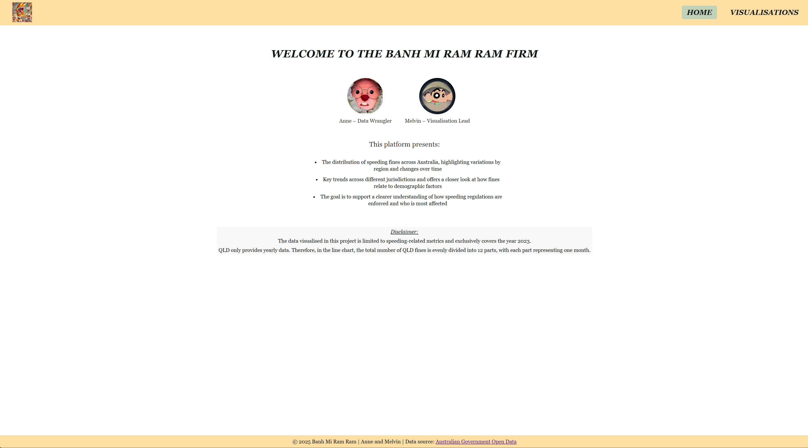

### 📍 Monthly Trends & Detection Methods
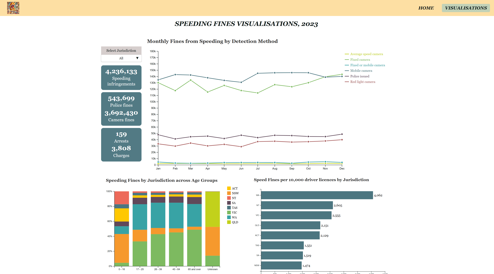

### 📍 Age Group & Jurisdiction Breakdown
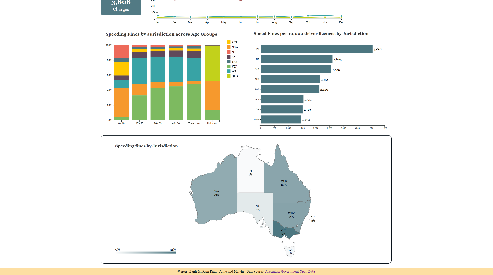

### 💡 Key Insights
- ✅ **Seasonal Spikes in Fines**: The data reveals significant monthly variations in speeding fines, with notable peaks typically occurring around public holidays and summer months, suggesting a correlation between increased travel and enforcement activity.
- ✅ **Camera vs. Officer Discrepancy**: Speed cameras account for a substantially higher number of fines compared to police-issued tickets, highlighting the critical role of automated enforcement in road safety.
- ✅ **Youth Demographic Overrepresentation**: Younger drivers, particularly those in the 20-29 age bracket, are disproportionately represented in speeding infringements across most Australian states.
- ✅ **Jurisdictional Hotspots**: Populous states like New South Wales and Victoria emerge as hotspots with the highest volume of fines, which corresponds to their larger road networks and extensive camera systems.

### 📈 Policy & Public Safety Recommendations
- 📌 **Targeted Safety Campaigns**: Develop and launch road safety campaigns aimed at the 20-29 age demographic, emphasizing the risks and consequences of speeding.
- 📌 **Increased Transparency**: Enhance public awareness regarding the locations and operational times of speed cameras to act as a deterrent and encourage compliance.
- 📌 **Optimized Patrol Deployment**: Use the insights on fine hotspots to inform the strategic deployment of police patrols, focusing on areas and times with higher instances of speeding.

###  ETL Process - KNIME Workflow
The raw data from various jurisdictions required significant cleaning and transformation. KNIME was used to create a robust ETL pipeline that standardized formats, handled missing values, and aggregated the data for visualization.
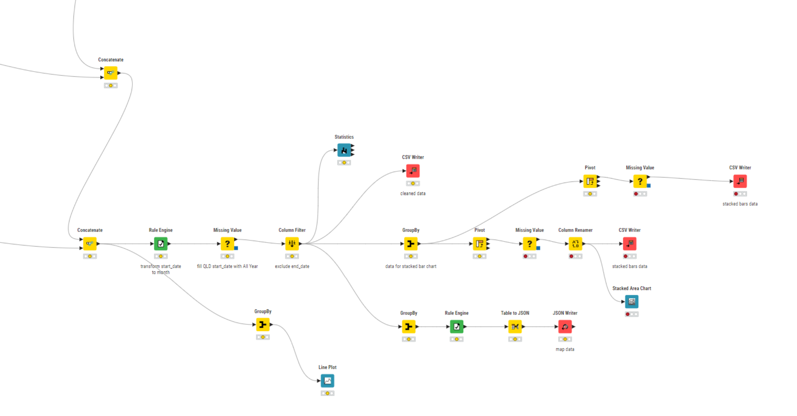

Click to view individual state workflows

### QLD Workflow
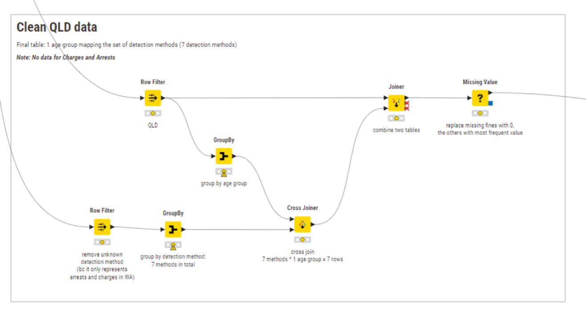

### ACT Workflow
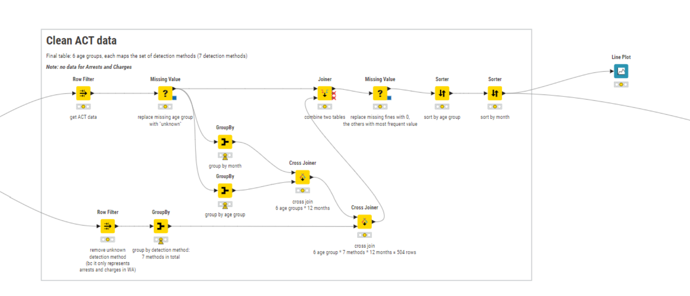

### NSW Workflow
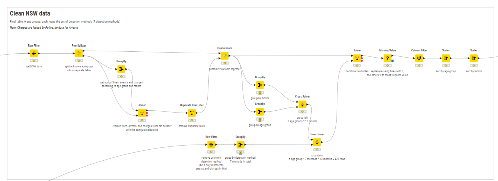

### NT Workflow
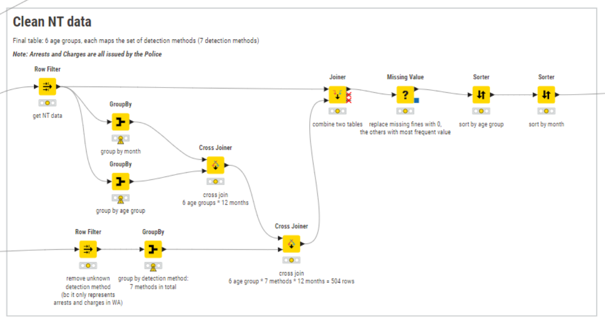

### SA Workflow
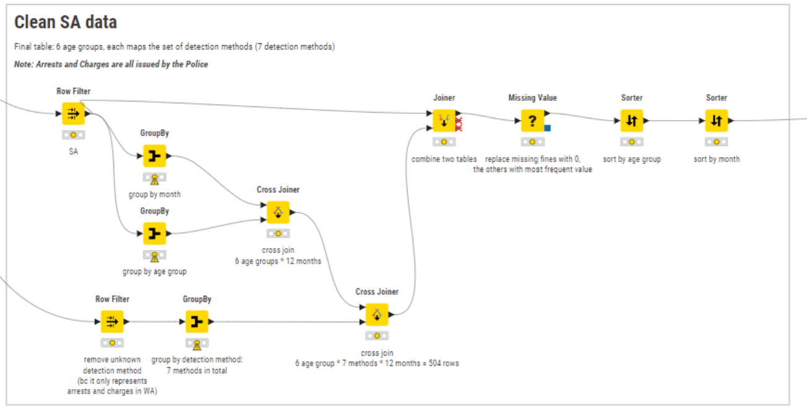

### TAS Workflow
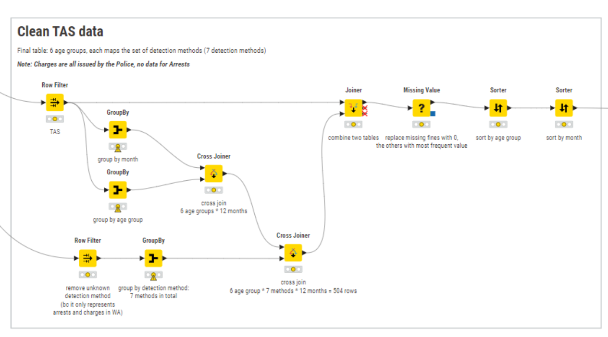

### VIC Workflow
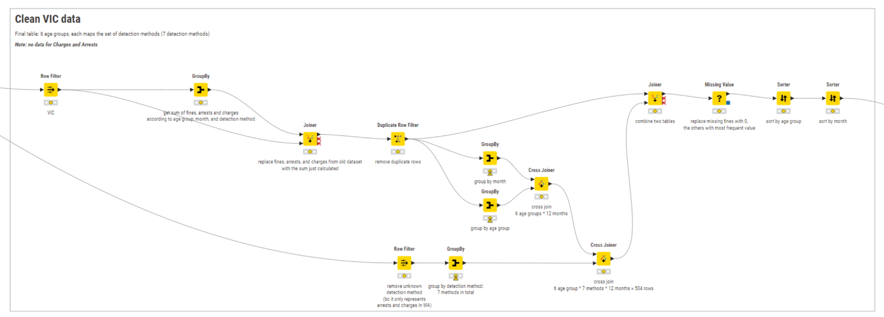

### WA Workflow
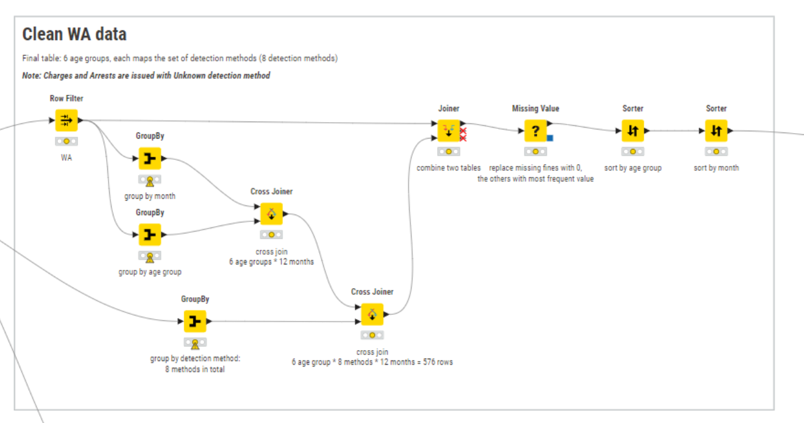

### 🛠️ Tech Stack
- **Visualizations**: D3.js v7
- **Front-End**: HTML5, CSS3, JavaScript (ES6+)
- **ETL & Cleaning**: KNIME Analytics Platform
- **Hosting**: Amazon S3 (static website)

### Project Files
- 📁 **[`Project Folder`](./Website-Dashboard-Speeding-Fines-2023-Australia/)** – Contains all project files including `index.html`, `js/`, `css/`, and `data/`.

## 4. HR Attrition Dashboard (Power BI)
Mr. Ryan, the Head of HR, wanted a comprehensive and interactive dashboard to analyze the company’s employees. The goal was to answer key HR questions about employee demographics, workforce size, attrition rates, hiring trends, performance ratings, and satisfaction scores. This dashboard allows executives to filter by department, gender, age group, and year to get both a high-level overview and detailed insights for better decision-making.

**View Live Dashboard:** [Click here to view on Power BI Service](https://app.powerbi.com/view?r=eyJrIjoiYTE5ZTk0ODctMzcwOS00OGU3LWFkZGUtMWZlYmY5ODdmMmFjIiwidCI6ImRmN2Y3NTc5LTNlOWMtNGE3ZS1iODQ0LTQyMDI4MGY1Mzg1OSIsImMiOjEwfQ%3D%3D&pageName=23985c93ca4941285647)

### Dashboard Snapshots
### 📍 Employee Overview
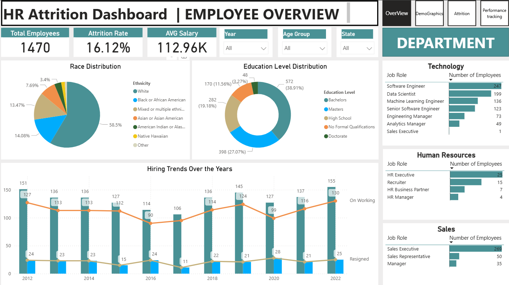

### 📍 Demographics
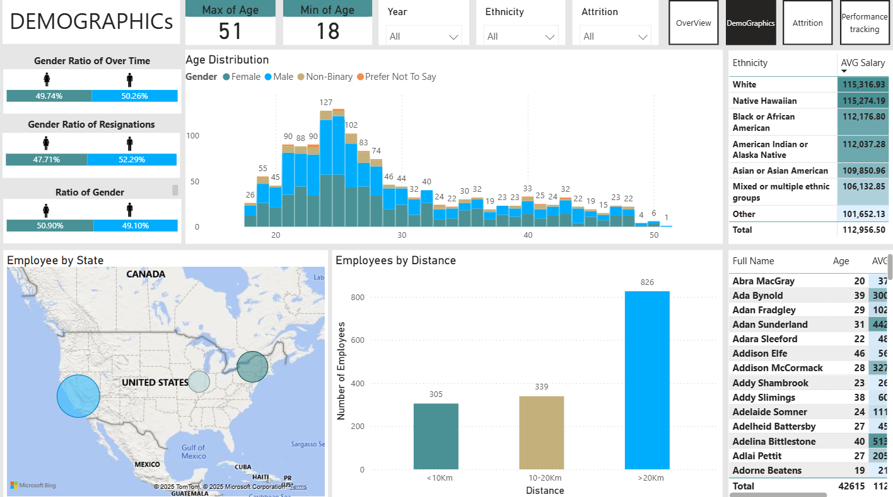

### 📍 Attrition Analysis
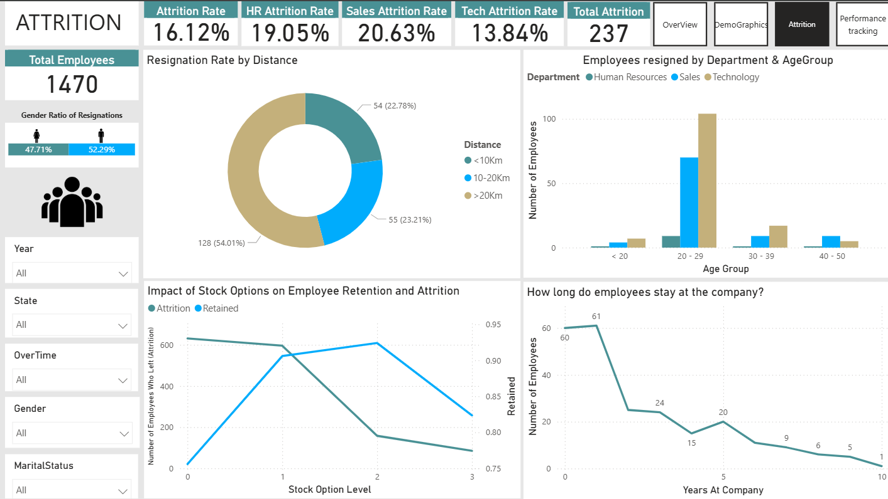

### 📍 Performance Tracking
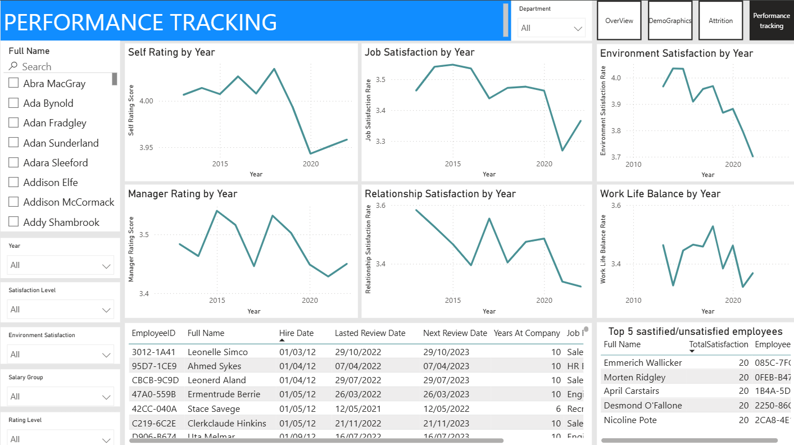

### 📍 Data Modeling (Star Schema)
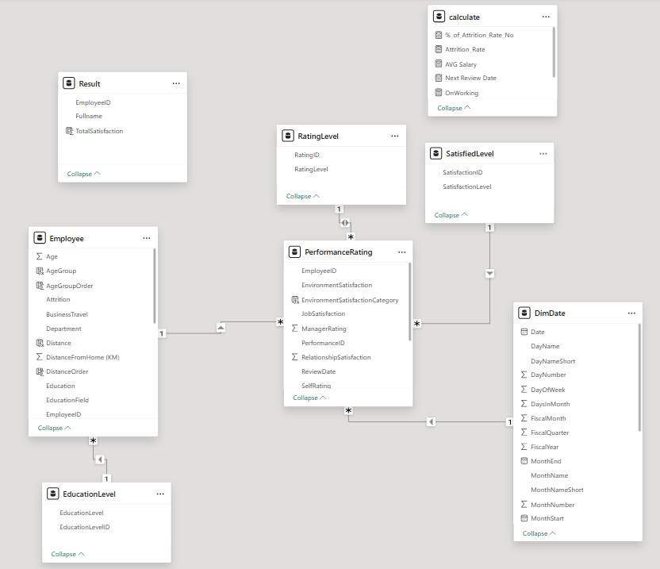

### 💡 Key Insights
- ✅ **Total Employees**: 1,470
- ✅ **Attrition Rate**: 16.12% (highest in Sales – 20.63%)
- ✅ **Demographic Trends**: The majority of employees are 20–29 years old, and this group also has the highest resignation rate.
- ✅ **Retention Factors**: Employees without stock options are more likely to leave.

### 📈 Recommendations to Reduce Attrition
- 📌 **Introduce stock options or bonuses** to improve retention, as higher attrition is seen among employees without them.
- 📌 **Enhance career growth for younger employees** with mentorship and training programs.
- 📌 **Focus on Sales & HR departments**, as these teams have the highest attrition rates.
- 📌 **Monitor job satisfaction closely**, as self-ratings and job satisfaction show downward trends.

### 🛠️ Tech Stack
- **Power BI Desktop & Power Query**: For data cleaning, transformation, and modeling.
- **DAX**: Used for creating KPIs and custom calculations.
- **Data Modeling (Star Schema)**: Implemented to optimize the data structure for reporting.

### Project Files
- 📄 **[`HR Attrition Dashboard.pbix`](./PowerBI-HR-Dashboard/HR%20Attrition%20Dashboard.pbix)**: The Power BI dashboard file.
- 📁 **[`dataset/`](./PowerBI-HR-Dashboard/dataset/)**: The complete dataset used for the analysis.

## 5. Contoso Sales Dashboard (Power BI)
The CEO of the Contoso e-commerce business needs a single interactive dashboard to understand the company’s sales performance and customer service efficiency. This dashboard helps them track revenue trends, see which products and campaigns bring in the most sales, and check if KPIs are being met. It also shows how well the customer service team is performing, who the top revenue clients are, and which open cases need attention so the company can improve client retention and satisfaction.

**View Live Dashboard:** [Click here to view on Power BI Service](https://app.powerbi.com/view?r=eyJrIjoiODEyNTQ4YzctZjdlMi00MjRmLTlhMzQtNTJkNDYwMzU5NGNkIiwidCI6ImRmN2Y3NTc5LTNlOWMtNGE3ZS1iODQ0LTQyMDI4MGY1Mzg1OSIsImMiOjEwfQ%3D%3D&pageName=ReportSection909ea50e7939156807d6)

### Dashboard Snapshots
### 📍 Sales Overview
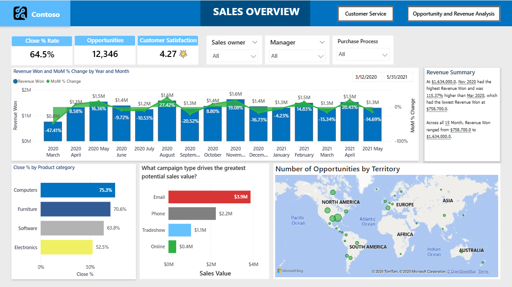

### 📍 Customer Service Analysis
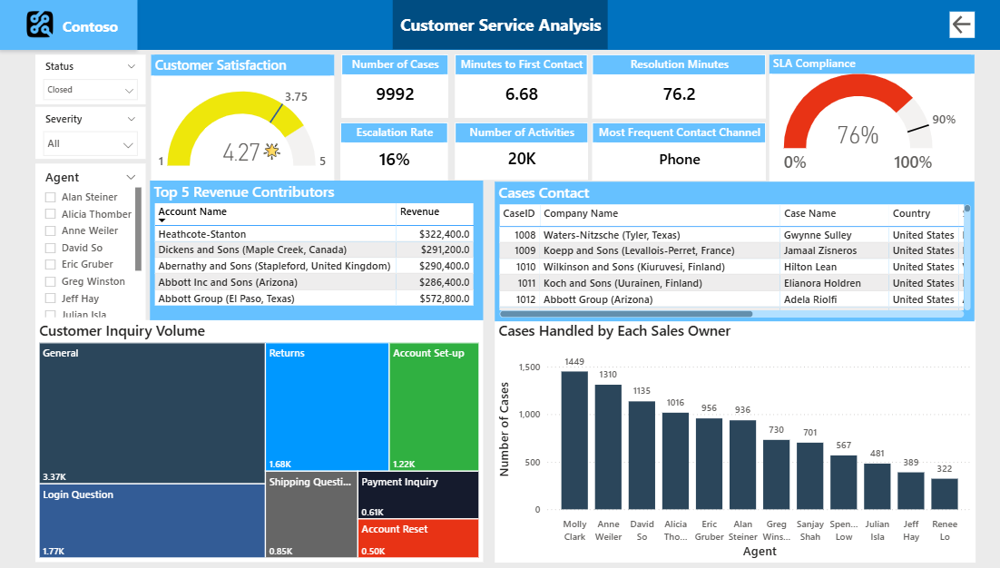

### 📍 Key Factors Driving Won vs Lost Deals
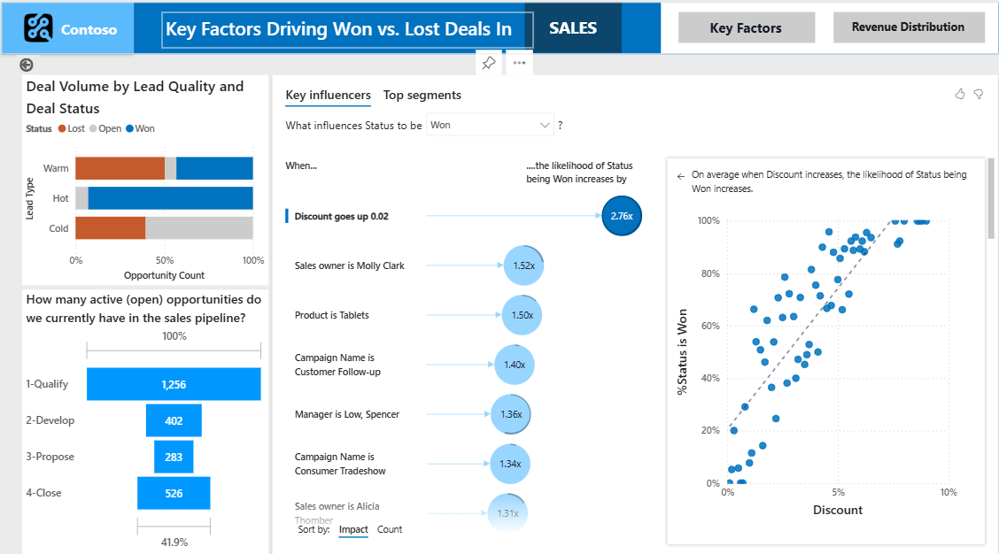

### 📍 Revenue Analysis – Performance & Contributors
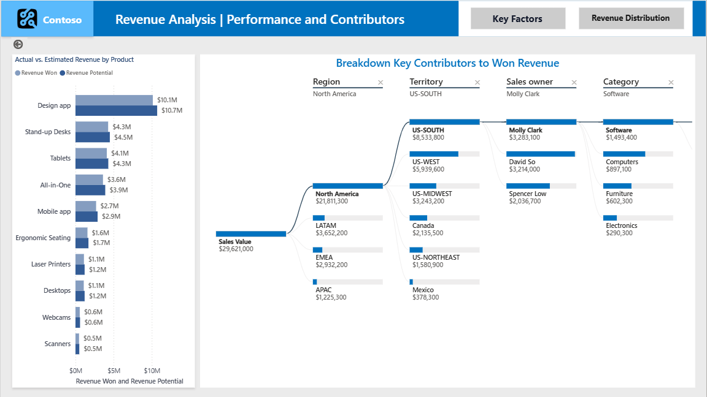

### 📍 Data Modeling (Snowflake Schema)
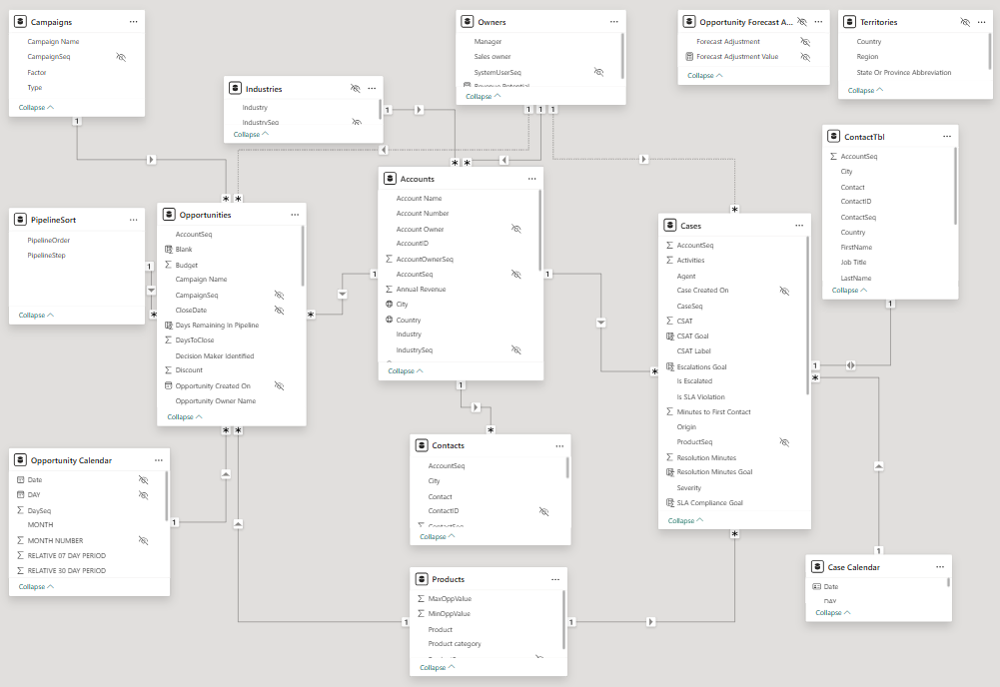

### 💡 Key Insights
- ✅ **Close Rate**: 64.5% with 12,346 total opportunities.
- ✅ **Revenue Trend**: The highest revenue months were July 2020 ($1.6M) and Jan 2021 ($1.6M).
- ✅ **Top Revenue Products**: Design App ($6.1M), Stand-up Desk ($4.5M), and Tablets ($4.1M).
- ✅ **Top Campaign Type**: Email campaigns generated the greatest potential sales value ($3.3M).
- ✅ **Top Clients**: Abbott Inc. and Abercathy & Sons are high-revenue contributors worth a retention focus.
- ✅ **Customer Service KPIs**: Average customer satisfaction is 4.27, with a 16% escalation rate and 76% SLA compliance.

### 📈 Recommendations for Business Growth
- 📌 **Focus on High-Revenue Products**: The Design App, Stand-up Desk, and Tablets have the highest returns.
- 📌 **Expand Email Marketing Campaigns**, as email generates the highest potential sales value.
- 📌 **Reward Top Clients** like Abbott Inc. and Abercathy & Sons with loyalty programs.
- 📌 **Improve Customer Service Efficiency** by reducing resolution times and escalation rates.

### 🛠️ Tech Stack
- **Power BI Desktop & Power Query**: For data cleaning and transformation.
- **DAX Measures**: For calculating KPIs for revenue, close rate, and customer satisfaction.
- **Data Modeling (Snowflake Schema)**: Implemented to optimize data for sales and customer service reporting.

### Project Files
- 📄 **[`ContosoDashboardFinal.pbix`](./PowerBI-Sales-Dashboard/ContosoDashboardFinal.pbix)**: The Power BI dashboard file.
- 📁 **[`dataset/`](./PowerBI-Sales-Dashboard/dataset/)**: The complete dataset used for the analysis.

📫 Connect With Me

Thank you for reviewing my portfolio. I'm passionate about data storytelling and always open to new opportunities and collaborations.

LinkedIn: https://www.linkedin.com/in/melvin-nguyen/
