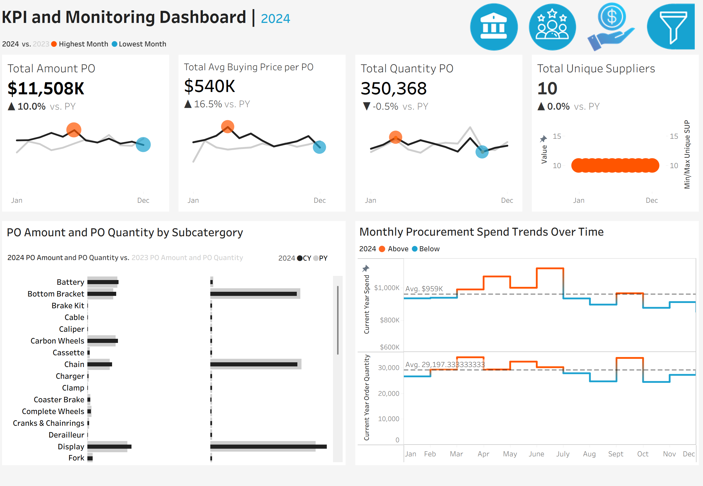
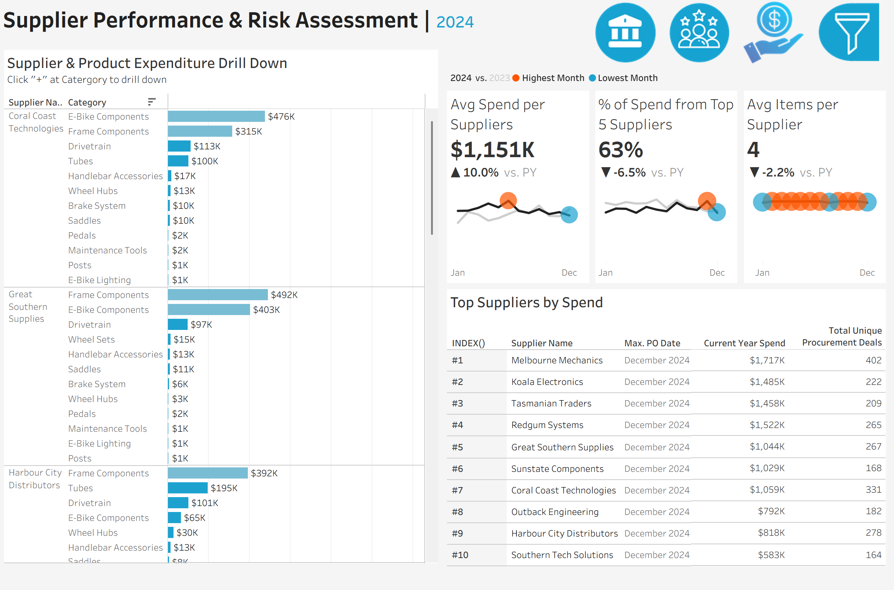
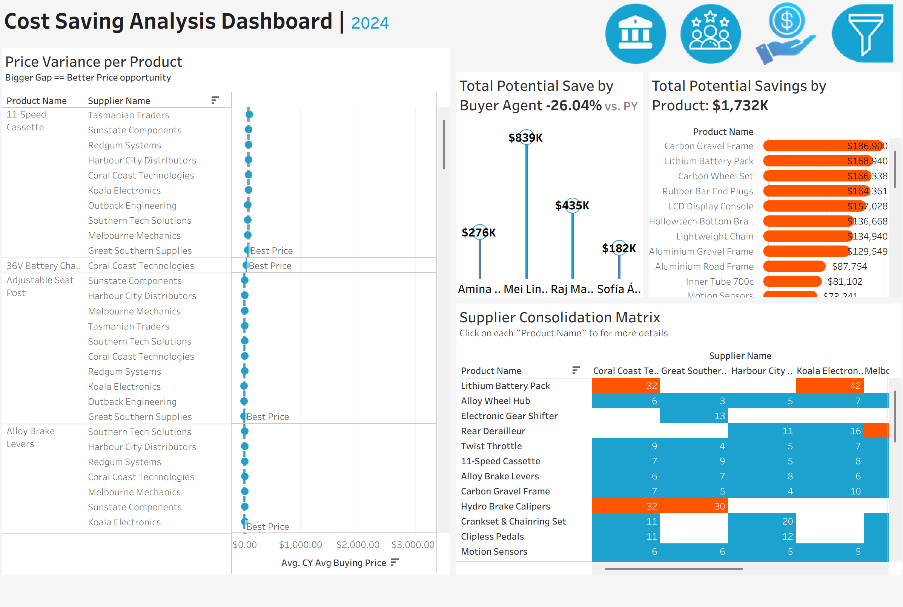
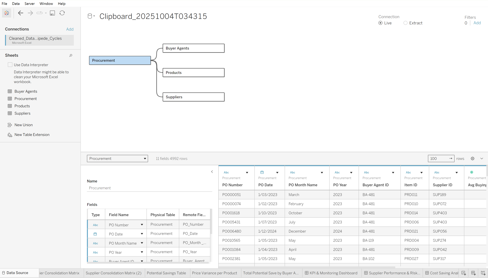

# Data-Analyticss-Portfolio
Melvin's Data Analytics Portfolio

Hi there! 👋 Welcome to my consolidated analytics portfolio. This repository brings together several key projects, showcasing my skills across a range of BI and web technologies, from Tableau and Power BI to custom web dashboards with D3.js.

My goal is to turn raw data into clear, actionable insights. Below, you'll find a summary of each project, including live links, key insights, and links to the project files.

🚀 Portfolio Quick Links

Procurement Dashboard (Tableau)

Speeding Fines Interactive Dashboard (D3.js)

HR Attrition Dashboard (Power BI)

Contoso Sales Dashboard (Power BI)

1. Procurement Dashboard (Tableau)
This dashboard provides a strategic analysis of procurement data for 'Velocipede Cycles', an expanding Australian retail chain. Faced with shrinking profit margins despite growing sales, the project dives into two years of purchasing data to identify cost-saving opportunities, mitigate supply chain risks, and enhance supplier management. The visualizations are designed for a senior management audience, translating complex data into clear, actionable insights.

**View Live Dashboard:** [Click here to view on Tableau Public](https://public.tableau.com/views/Velocipede_Cycles_Procurement_Analytics_Dashboard/KPIMonitoringDashboard?:language=en-US&:sid=&:redirect=auth&:display_count=n&:origin=viz_share_link)

### Dashboard Snapshots
### 📍 KPI Monitoring Dashboard

### 📍 Supplier Performance Dashboard

### 📍 Cost Saving Analysis Dashboard

### 📍 Data Modelling

### 💡 Key Insights

✅ **High-Risk Supplier Concentration:** Spend grew 10% year-on-year to $11.5M, but remains concentrated on just 10 suppliers. The top four vendors account for 54% of total spend, creating significant supply chain vulnerability.
✅ **Strategic Components Drive Budget:** Nearly half (49%) of the entire procurement budget is spent on just three categories—frames, displays, and batteries. Optimizing costs in these areas offers the highest potential financial impact.
✅ **Untapped Savings in Price Variance:** Significant price gaps exist for identical items between suppliers (e.g., a $260 difference per carbon frame), highlighting clear opportunities for cost reduction through strategic sourcing.
✅ **Evidence of Successful Past Optimizations:** A 26% decrease in overall potential savings from 2023 indicates that prior cost-cutting initiatives were effective, particularly in core component categories.
✅ **Predictable Seasonal Spending Patterns:** Procurement activity follows a clear seasonal cycle with peaks in March–April and June–October, offering strategic windows for contract negotiations during quieter periods.

### 📈 Recommendations for Business Growth

📌 **Diversify the Supplier Base:** Actively onboard alternative suppliers for critical components like frames and electronics to mitigate the risk of over-reliance on a few key vendors.
📌 **Renegotiate High-Value Contracts:** Leverage the high spend volume in top categories (frames, displays, batteries) to renegotiate pricing and terms for better margins.
📌 **Consolidate Purchasing with Cost-Effective Suppliers:** Shift purchasing volume for items with high price variance to consistently lower-priced suppliers to realize immediate cost savings.
📌 **Focus on Next-Generation Cost Initiatives:** With initial "easy wins" realized, pivot to more advanced cost-saving strategies like supplier innovation, component standardization, and design optimization.
📌 **Align Negotiation Cycles with Off-Peak Seasons:** Schedule major contract reviews and supplier negotiations during quieter procurement months (e.g., Jan-Mar) to gain a strategic advantage.

### 🛠️ Tech Stack
- **Tableau Desktop & Tableau Prep Builder** – Data cleaning, transformation, modeling, and creation of interactive dashboards.
- **Data Modeling** – Developed a logical data model to structure procurement data for analysis.
- **Interactive Visuals** – Designed intuitive and compelling visualizations to support executive decision-making.

### Project Files
- 📄 **[`final_dashboard.twbx`](./Tableau-Procurement-Dashboard/final_dashboard.twbx)** – The complete Tableau workbook package containing all dashboards, data sources, and formatting.
- 📊 **[`Cleaned_Data_Velocipede_Cycles.xlsx`](./Tableau-Procurement-Dashboard/dataset/Cleaned_Data_Velocipede_Cycles.xlsx)** – The cleaned and prepared dataset used for the analysis.

2. HR Attrition Dashboard (Power BI)

This dashboard analyzes employee attrition (turnover) to identify key factors driving employees to leave. The goal is to provide actionable insights for the HR department to improve retention.

View Live Dashboard: Click here to view on Power BI Service

Browse Project Files: ./PowerBI-HR-Dashboard/ (Contains the HR Attrition Dashboard.pbix file, dataset, and images)

💡 Key Insights

Insight 1: [e.g., "Employee attrition is highest within the 'Sales' department, specifically among those with 1-2 years of tenure."]

Insight 2: [e.g., "A low 'JobSatisfaction' score combined with 'OverTime' work is the strongest predictor of attrition."]

Insight 3: [e.g., "Employees who travel frequently for work have a 25% higher attrition rate than those who do not."]

🛠️ Tools & Data

Tools: Power BI, DAX, Power Query

Dataset: [e.g., "IBM HR Analytics Employee Attrition & Performance dataset."]

3. Contoso Sales Dashboard (Power BI)

This dashboard tracks key sales KPIs for the fictional company Contoso. It breaks down revenue, profit, and units sold by region, product category, and time.

View Live Dashboard: Click here to view on Power BI Service

Browse Project Files: ./PowerBI-Sales-Dashboard/ (Contains the ContosoDashboardFinal.pbix file, dataset, and images)

💡 Key Insights

Insight 1: [e.g., "While 'Computers' generate the most revenue, the 'Audio' category has the highest profit margin at 48%."]

Insight 2: [e.g., "The 'Online' sales channel is outperforming 'Reseller' by 30% in year-over-year growth."]

🛠️ Tools & Data

Tools: Power BI, DAX

Dataset: [e.g., "Contoso Sales public dataset from Microsoft."]

4. Interactive Speeding Fines Dashboard (D3.js)

This is a fully interactive, custom-built web dashboard using D3.js to visualize data on speeding fines. Users can filter and explore the data to understand patterns in enforcement.

View Live Website: Click here to view the live dashboard

Browse Project Files: ./Website-Dashboard-Speeding-Fines-2.../ (Contains the index.html, js/, css/, and data/ files)

💡 Key Features

Feature 1: [e.g., "Interactive bar chart that updates dynamically based on user-selected filters (e.g., time of day, fine amount)."]

Feature 2: [e.g., "Data processed and cleaned using a KNIME workflow (speedfines-1.knwf)."]

Insight 1: [e.g., "A key finding from the dashboard is that the highest number of fines occurs between 8-10 AM on weekdays."]

🛠️ Tools & Data

Tools: JavaScript (ES6+), D3.js, HTML5, CSS3, KNIME (for data prep)

Dataset: [e.g., "Publicly available data on speeding fines from..."]

📫 Connect With Me

Thank you for reviewing my portfolio. I'm passionate about data storytelling and always open to new opportunities and collaborations.

LinkedIn: https://www.linkedin.com/in/yourprofile

My Website: https://www.yourpersonalwebsite.com